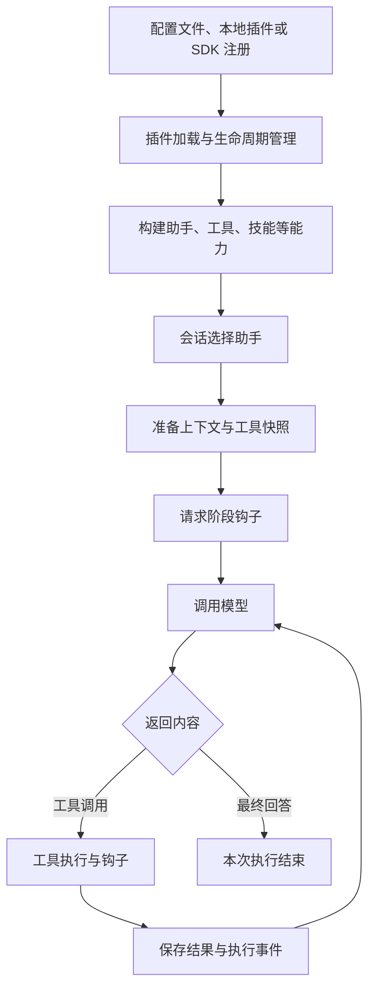

# OpenCode v2 扩展机制研究与接入说明

> 研究日期：2026-09-13。本文描述 OpenCode v2 的通用插件能力，包括插件类型、加载机制、能力注册、执行钩子、权限边界与生命周期，供插件开发和嵌入式集成参考。
>
> 代码基线为所研究的 OpenCode 仓库 `v2` 分支，提交为 `2308db16387c9b59e88d732a93ec9bac54462b03`。源码引用采用该固定提交内的仓库相对路径；文中的接口与行为以此版本为准，不代表其他 OpenCode 版本或旧版插件 API 的兼容承诺。
>
> 本文是源码研究与能力说明。代码示例用于解释接口和调用方式，未经独立运行验证。

## Plugin：扩展入口

### 什么是 Plugin

**OpenCode 的扩展通过注册能力和执行钩子接入已有运行流程。** Extension 在当前 OpenCode v2 实现中主要对应 Plugin 机制。插件可以提供助手、工具、技能、模型、命令等能力，也可以在指定执行节点调整行为；会话运行、模型请求、工具结果和执行记录仍由 OpenCode 核心处理。



### Plugin 的分类

**内部插件、外部插件和 SDK 插件按接入来源区分，最终进入同一套运行管理。** 三者都可以注册助手、工具和执行钩子。区别主要在于谁提供插件定义、如何装入宿主，以及宿主是否额外注入核心内部服务。这里讨论的是服务端插件；终端界面的 TUI 插件属于另一个扩展入口。

| 比较项 | 内部插件 | 外部插件 | SDK 插件 |
| --- | --- | --- | --- |
| 提供者 | OpenCode 源码与发行版本 | 项目或独立插件包的维护者 | 嵌入 OpenCode 的应用宿主 |
| 入口 | `PluginInternal` 的 `pre` / `post` 集合 | 目录发现、配置中的文件或包 | 嵌入式宿主的 `opencode.plugin(definition)` |
| 装载形式 | 核心代码直接导入定义 | 解析模块并读取默认导出 | 在内存中直接传入插件对象 |
| 可用接口 | 公开 Context，加上宿主注入的内部服务 | 公开 Plugin Context | 公开 Plugin Context；可通过闭包使用宿主主动传入的依赖 |
| 主要配置方式 | 原生配置、内部服务或内置默认值 | `plugins[].options` → `ctx.options` | 宿主代码与闭包；注册接口没有单独的 `options` 参数 |
| 更新来源 | 跟随 OpenCode 代码版本；部分插件自行监听配置变化 | 配置变化、受支持的本地入口变化或包配置变更 | 宿主再次注册插件，递增内部修订号 |
| 实例范围 | 每个 Location 独立激活 | 按各 Location 的配置分别激活 | 同一宿主共享定义，每个 Location 独立激活 |
| 适用场景 | 实现原生助手、工具、供应商与配置处理 | 给已有 OpenCode 服务增加项目或业务能力 | 在自己的 JS/TS 应用中嵌入并管理 OpenCode |

Effect 和 Promise 是插件的两种编写接口方法。一个采用公开接口的 Effect 插件对象，既可以默认导出后由配置加载，也可以直接交给嵌入式 SDK 注册；核心能力可以复用，但加载顺序和配置传入方式会发生变化。

**内部插件把 OpenCode 自身的一部分功能组织成插件。** 它们不是用户安装到目录里的特殊文件，而是由核心源码静态导入，并在 `PluginInternal` 中明确列入集合。`PluginInternal.list()` 获取当前 Location 所需的服务，通过 `Effect.provide(context)` 注入内部插件，再交给统一加载器。

这里有两层 Context：`effect(ctx)` 的参数仍然是公开 Plugin Context；内部插件通过 Effect 环境另外取得 `Config.Service`、`Permission.Service`、`Shell.Service`、`Location.Service` 等服务。因此，“内部插件有更多能力”的依据是宿主明确注入了依赖，不是插件 ID 以 `opencode.` 开头。

| 内部插件示例 | 所处集合 | 实际职责 |
| --- | --- | --- |
| `opencode.agent` | `pre` | 注册原生助手的基础定义 |
| `opencode.tool.shell` | `pre` | 注册 Shell 工具，结合原生执行、权限和运行状态服务 |
| 原生供应商、搜索及其他工具插件 | `pre` | 提供模型、搜索和工具的基础能力 |
| `opencode.config.agent` | `post` | 读取助手配置和相关 Markdown 文件，把结果应用到助手清单 |
| 配置供应商、技能、策略及模型变体插件 | `post` | 在前面贡献的能力上应用配置或后续处理 |

这也解释了自定义助手与内部插件的关系：用户编辑助手配置，真正负责读取、监听和应用这些配置的是 `opencode.config.agent`。每个自定义助手是一份 Agent 定义，并不需要对应一个独立插件。外部插件或 SDK 插件也可以注册 Agent，之后再由配置插件调整。

内置插件同样参与配置中的启停选择。例如 `-opencode.config.agent` 会让负责应用助手配置的插件退出当前激活集合，相应配置能力也会受到影响。是否保留某个内置插件，应根据其实际职责判断。

需要增加依赖 Core 私有服务的原生功能时，通常要修改 OpenCode 源码，把插件加入内置集合；若新增服务依赖，还需要调整相应服务装配。这类变更随 OpenCode 一起构建、发布和升级。内部插件适合引擎自身功能，普通业务工具优先通过公开接口接入。

依据：内部插件集合与服务注入（`packages/core/src/plugin/internal.ts`）、原生助手插件（`packages/core/src/plugin/agent.ts`）、助手配置插件（`packages/core/src/config/plugin/agent.ts`）、Shell 工具插件（`packages/core/src/tool/plugin/shell.ts`）。

**外部插件通过文件或包给现有 OpenCode 服务增加能力。** “外部”指代码来源不在内置集合中，执行时仍然装入 OpenCode 进程。加载器向它提供公开 Plugin Context，不会像内部插件一样额外注入 Core 服务。它仍能使用运行环境允许的文件、网络等能力；这不是一个独立进程或安全沙箱。

外部插件有两条发现路径：

- **自动发现**：扫描原生配置目录下的 `plugin/` 和 `plugins/`。当前实现直接识别 `.ts`、`.js` 文件，也支持解析包目录及符合条件的符号链接。包目录会尝试 `package.json` 中字符串形式的 `exports`、`module`、`main`，再尝试 `index.ts`、`index.js`；不能把这里的简单发现逻辑等同于支持所有复杂包导出规则。
- **显式配置**：`plugins` 接受相对路径、绝对路径、文件 URL 和可解析的包。相对路径按配置文件所在目录解析；本地路径进入模块加载，包目标交给包解析器，并尝试 `server` 子入口或包根入口。

自动发现结果先进入操作列表，显式配置随后应用，因此可以在配置中关闭自动发现的插件。自动发现并不直接枚举 `.mjs` 文件；使用此类入口时，需要显式配置其路径，并由运行环境完成模块加载。

```json
{
  "plugins": [
    {
      "package": "./plugins/example.ts",
      "options": {
        "serviceUrl": "https://api.example.com"
      }
    }
  ]
}
```

上述路径是配置格式示例。插件通过 `ctx.options` 读取 `serviceUrl`，并自行检查必填项、取值范围和地址约束；传入对象不代表业务配置已经完成校验。

外部模块必须默认导出一个带有 `id + effect` 或 `id + setup` 的插件对象：

| 编写方式 | 初始化入口 | 接入方式与清理 |
| --- | --- | --- |
| Effect | `effect(ctx)` | 由宿主在插件 Scope 内执行；资源绑定 scoped 生命周期或 finalizer |
| Promise | `setup(ctx)` | 加载器通过 `fromPromise` 转为 Effect 插件；可以返回 cleanup 函数 |

`@opencode-ai/plugin/effect` 提供 Effect API，包根入口 `@opencode-ai/plugin` 提供当前分支的 Promise API。旧版插件 API 有独立的 `v1` 入口，不能仅凭“同样是 OpenCode 插件”假定接口兼容。

外部插件的典型加载链路为：

```text
配置目录 / plugins 配置
  → ConfigPluginSource 生成有序操作与本地文件时间戳
  → PluginSupervisor 解析路径或包、导入模块、校验默认导出
  → 适配 Promise 定义，并注入该来源的 options
  → Plugin.Service 创建 Location 内的插件实例
  → 注册助手、工具、钩子及需要清理的资源
```

文件或配置变化可以触发重新生成插件集合；这是发现与监听支持范围内的更新，不是任意依赖文件都能实时刷新。特别是显式配置目录入口时，当前实现不保证目录内部文件变化会触发重载。包版本的升级也应通过明确的部署或配置变更管理。

模块导入或导出格式校验失败会记录加载警告，该次来源被跳过；进入激活阶段后的初始化失败则由统一插件管理处理。诊断时需要分别确认“文件已被发现”“模块已成功解析”“插件已激活”和“能力已注册”，仅看到配置项不足以证明工具可用。

依据：来源发现与本地监听（`packages/core/src/config/plugin/source.ts`）、模块加载与配置注入（`packages/core/src/plugin/supervisor.ts`）、公开包入口（`packages/plugin/package.json`）、Promise 适配器（`packages/plugin/src/promise/adapter.ts`）。

**SDK 插件由嵌入式宿主直接注册，适合把 OpenCode 作为应用内部的执行引擎。** 本文的 SDK 特指当前分支的 `@opencode-ai/sdk-next` 嵌入式宿主。`OpenCode.create()` 在应用进程内创建运行环境和内存中的 HTTP 路由调用链，不需要为这条内部调用链开启网络监听；工具、模型和业务服务仍可发起各自的网络请求。

宿主通过 `opencode.plugin(definition)` 直接提交 Effect 插件对象，省去外部模块发现、包解析和默认导出校验。这不是向一个已经启动的远程 OpenCode 服务上传代码。普通 HTTP 客户端和插件 Context 中的 `ctx.plugin.list()` 也不等于这个嵌入式注册入口。

下例展示嵌入式宿主的插件注册与查询方式，需使用与研究基线匹配的依赖版本：

```ts
import { AbsolutePath, Location, OpenCode } from "@opencode-ai/sdk-next"
import { Effect } from "effect"

const program = Effect.gen(function* () {
  const opencode = yield* OpenCode.create()

  yield* opencode.plugin({
    id: "example.reviewer",
    effect: (ctx) =>
      ctx.agent.transform((draft) => {
        draft.update("reviewer", (agent) => {
          agent.description = "检查代码并给出修改建议"
          agent.system = "分析代码质量，并说明建议的依据。"
          agent.mode = "primary"
        })
      }).pipe(Effect.asVoid),
  })

  const location = Location.Ref.make({
    directory: AbsolutePath.make(process.cwd()),
  })
  return yield* opencode.plugin.list({ location })
})

const result = await Effect.runPromise(program.pipe(Effect.scoped))
console.log(result.data)
```

示例中的助手只定义用途和提示词，权限需要另行配置。示例执行结束会关闭拥有宿主的 Scope；真实嵌入式应用应让该 Scope 覆盖整个服务生命周期。

SDK 插件的范围和更新方式需要分两层理解：

| 层次 | 管理内容 | 生效范围 |
| --- | --- | --- |
| 宿主注册表 | `Map<plugin.id, Versioned>`，保存定义和递增修订号 | 同一个嵌入式宿主共享；不同宿主拥有各自的注册表 |
| Location 激活集合 | 该目录上下文内的插件实例、Transform、Hook 与 Scope | 每个 Location 分别激活与清理 |

每次注册都会发布 `sdk.plugin.updated`。已启动的 Location 收到更新后重新生成插件集合；之后新启动或被回收后重新启动的 Location，从宿主注册表读取当前定义。因此，“宿主只注册一次”不意味着插件初始化只执行一次。闭包中的可变对象也可能被同一宿主的多个 Location 实例共享，不能默认把它当作单个会话的状态。

同一 SDK 注册表内再次提交相同 ID，会替换定义并产生新修订号；不同宿主之间互不覆盖。注册返回仅表示定义已写入并发布更新，不代表所有 Location 已同步完成激活。需要确认生效时，应检查目标 Location 的实际插件和能力清单，并在必要时等待激活事件。

当前 SDK 注册表只提供 `register` 与 `all`，没有独立的 `unregister` 接口。各 Location 的配置仍可以通过插件 ID 禁用其激活，但这不会从宿主注册表删除定义。关闭宿主会清理运行资源；重新创建宿主需要重新注册插件，原来的内存注册不是持久安装记录。

SDK 注册入口接收 Effect 插件，外部加载器对 Promise 插件的自动适配不会在这里自动发生。需要复用 Promise 定义时，应显式使用对应的 `fromPromise` 适配器。SDK 路径没有额外的 `options` 注入，公开 Context 默认提供空对象；宿主通常用工厂函数或闭包传入自己的配置与业务客户端。

SDK 插件也不会自动取得内部插件的 Core 服务环境。宿主可以主动传入依赖，但直接依赖 Core 私有服务意味着承担额外的版本耦合。研究基线中的 `sdk-next` 还是 `private: true` 的过渡包，不能把这个示例视为已发布稳定 npm API 的安装承诺。

依据：嵌入式宿主入口（`packages/sdk-next/src/opencode.ts`）、SDK 注册表（`packages/core/src/plugin/sdk.ts`）、SDK 包状态（`packages/sdk-next/package.json`）、公开插件宿主（`packages/core/src/plugin/host.ts`）。嵌入式测试源码（`packages/sdk-next/test/embedded.test.ts`）包含跨 Location 更新、Location 回收后重新激活及宿主间隔离的用例；本文核对了这些用例，未独立运行测试。

**三种来源会合并成一个有顺序的激活集合。** 在启用项确定之后，当前顺序是：

```text
内部 pre → SDK 注册插件 → 外部文件 / 包插件 → 内部 post
```

`ConfigPluginSource` 负责外部来源与配置操作；`PluginSupervisor` 把它们与内部、SDK 定义合并；`Plugin.Service` 负责最终的重复 ID 检查、Scope、初始化与替换。不要把不同来源理解为三套独立运行引擎。

这个顺序意味着外部和 SDK 插件贡献的助手等能力，仍可能被后置配置插件调整。需要确定助手的最终提示词、模型或权限时，应读取最终能力清单，而不是只看某个插件中的初始定义。

插件 ID、包名和入口路径承担不同职责。比如配置通过文件加载一个导出 ID 为 `example.reviewer` 的插件，禁用时应写 `-example.reviewer`。选择器支持精确 ID、`prefix.*` 和 `*`；配置操作按顺序执行，后续操作可以重新启用已有定义。

有两个容易混淆的重名规则：

- **同一 SDK 注册表内重复注册相同 ID**：更新该条定义，属于注册表支持的替换操作。
- **不同有效来源最终贡献相同 ID**：激活阶段按重复 ID 拒绝这一轮集合，不是按来源优先级静默覆盖。外部文件与 SDK 注册不要同时提交同一插件定义。

另外，当前 `Plugin.Service` 在整个有序集合的 ID 与版本完全一致时跳过激活；一旦集合发生变化，会遍历新集合，清理并重新初始化其中已有的插件。因此，一个来源发生更新也可能让其他未修改的插件重新初始化。三类插件都应正确释放资源，避免把初始化当作只执行一次的业务动作。替换失败会尝试恢复该插件旧版本，但无法回滚已产生的外部业务副作用。

依据：来源合并与启停顺序（`packages/core/src/plugin/supervisor.ts`）、统一激活与替换（`packages/core/src/plugin.ts`）、配置与加载顺序测试源码（`packages/core/test/config/plugin.test.ts`）。

## Plugin 核心实现一：Transform

**Transform 用来声明能力，Hook 用来处理一次运行。** 选择扩展点时，应先确定需求属于哪种领域。

| 需求 | 原生扩展接口 |
| --- | --- |
| 注册、修改或移除助手 | `ctx.agent.transform` |
| 注册实际可执行工具 | `ctx.tool.transform` |
| 提供技能说明与资源入口 | `ctx.skill.transform` |
| 增加命令 | `ctx.command.transform` |
| 调整供应商、模型目录与默认选择 | `ctx.catalog.transform` |
| 提供参考资料来源 | `ctx.reference.transform` |
| 配置认证和连接方式 | `ctx.integration.transform` |
| 提供搜索后端 | `ctx.websearch.transform` |
| 修改本轮上下文与可见工具 | `ctx.session.hook("context", ...)` |
| 检查工具输入或整理结果 | `ctx.tool.hook(...)` |
| 调整模型 SDK 或模型实例 | `ctx.aisdk.hook(...)` |
| 调整模型 HTTP 请求或响应 | `ctx.session.hook("http.request" / "http.response", ...)` |
| 调整命令创建参数 | `ctx.shell.hook("create.before", ...)` |
| 观察实时事件 | `ctx.event.subscribe()` |
| 创建、投递、等待或中断会话 | `ctx.session.*` |

Agent、Catalog、Command、Integration、Reference、Skill 等状态领域保存活动 Transform，并从基础状态按顺序重建。卸载某个插件后，对应 Transform 被移除，再重新生成结果。Transform 应只编辑本次回调提供的 Draft，不应保存 Draft 引用，也不适合在重建时产生外部业务副作用。需要外部数据时，先加载并保存数据，再触发相应领域的 `reload()`。

Tool 的底层实现采用与 Scope 绑定的工具注册和请求快照。它与上述领域具有相同的生命周期归属，但不能推断所有 `transform` 都使用完全相同的状态容器或返回类型。

## Plugin 核心实现二：Hook

**Hook（执行钩子）是宿主在运行流程中预留的扩展点。** 插件向某个扩展点注册回调函数，OpenCode 执行到对应节点时，便自动调用这些回调，并传入该节点的上下文数据。插件可以按接口约定读取数据、调整参数或处理结果，从而参与模型请求、工具执行等流程。

Hook 的使用分为注册和触发两个阶段：插件初始化时，通过 `ctx.session.hook(...)`、`ctx.tool.hook(...)` 等接口声明要参与的节点；实际运行到该节点时，宿主才执行注册的回调。注册一次后，回调可以随着对应节点再次执行而多次触发。宿主会等待回调完成，再按该接口的约定继续处理；例如 `tool.execute.before` 允许通过 `Tool.Error` 拒绝这次工具执行。

Transform 负责构建可用能力，Hook 负责调整能力在具体执行节点的行为。例如，注册一个工具使用 `ctx.tool.transform`；检查某次工具调用的输入，可以使用 `ctx.tool.hook("execute.before", ...)`；调整即将发送给模型的上下文，可以使用 `ctx.session.hook("context", ...)`。Hook 参与当前调用链，而 `ctx.event.subscribe()` 用于订阅事件并观察运行情况。

运行 Hook 按注册顺序串行执行，后注册的 Hook 可以看到前面的修改。多个插件修改同一字段时，需要检查最终加载顺序；内置插件分为前置与后置集合，不能简单假定“外部插件永远最后覆盖”。

| Hook | 可修改或观察的内容 | 注意事项 |
| --- | --- | --- |
| `session.context` | 系统提示、消息、本轮工具定义 | 助手和模型标识是上下文身份；修改消息仅代表本轮请求调整，不等于追加持久历史 |
| `tool.execute.before` | 工具输入 | 可以返回 `Tool.Error` 阻止执行 |
| `tool.execute.after` | 成功结果或工具错误 | 用于整理结果和补充信息 |
| `session.http.request/response` | 模型 HTTP 请求与响应 | 可能接触凭据和完整输入，需控制记录内容 |
| `aisdk.sdk/language` | SDK 与实际模型实例 | 适合供应商适配 |
| `shell.create.before` | 命令、目录、时限、Shell 与环境变量 | 字符串规则本身不能提供系统级隔离 |

当前公开 Hook 类型中，只有 `tool.execute.before` 声明了可恢复的 `Tool.Error` 失败通道。其他 Hook 不应被当作任意抛出业务错误的通用中间件。

依据：Plugin Context（`packages/plugin/src/effect/plugin.ts`）、状态重建（`packages/core/src/state.ts`）、Hook 注册与执行（`packages/core/src/plugin/hooks.ts`）、工具注册与快照（`packages/core/src/tool.ts`）。

## 工具示例与生命周期

### 示例一：使用 Plugin Transform 定义 Tool

**工具包含模型可见的定义和宿主执行的函数。** 模型生成工具名与输入后，OpenCode 使用本轮捕获的工具能力处理调用。工具函数接收宿主提供的 `sessionID`、`agent`、`messageID` 和调用 `id`，长操作可以通过 `context.progress()` 提供进度。

下面是一个使用 Effect API 的独立工具示例：

```ts
import { Plugin } from "@opencode-ai/plugin/effect"
import { Effect, Schema } from "effect"

export default Plugin.define({
  id: "example.echo",
  effect: Effect.fn(function* (ctx) {
    yield* ctx.tool.transform((tools) => {
      tools.add({
        name: "echo",
        description: "返回收到的文字",
        input: Schema.Struct({ text: Schema.String }),
        output: Schema.Struct({ text: Schema.String }),
        options: { codemode: false },
        execute: ({ text }) =>
          Effect.succeed({
            output: { text },
            content: text,
          }),
      })
    })
  }),
})
```

结果字段需要按用途区分：`output` 是声明输出 Schema 后供程序使用的结构化值；`content` 提供给模型并进入会话内容；`metadata` 承载有界的附加状态。未声明输出 Schema 却返回 `output`，在当前运行实现中属于错误。

源码中有两个比接口名称更具体的校验细节：

- `tool.execute.before` 先于工具运行函数中的 Schema 解码执行。因此 Hook 读取输入时仍应把它当作未知结构；Hook 修改后的输入才进入后续解码。
- Effect Schema 和支持的 Standard Schema 会执行运行时输入校验；纯 JSON Schema 分支直接传递输入。纯 JSON Schema 输出分支也只检查是否为 JSON 值，不逐项验证声明的约束。业务工具不能把“向模型提供了 JSON Schema”视为“服务端已验证参数”。

在当前工具通道里，执行前 Hook 自身失败会直接中止后续流程；不能假定 `execute.after` 总会为这类拒绝触发。审计设计需要覆盖拒绝路径，而不是只监听成功执行之后。

预期、可恢复的工具失败可以映射为 `Tool.Error`。取消执行、未知程序缺陷和成功结果需要保留不同语义，不应统一吞掉后返回一条普通成功文本。

依据：工具类型（`packages/schema/src/tool.ts`）、工具执行封装（`packages/core/src/tool.ts`）、实际参数校验（`packages/core/src/tool/runtime.ts`）。

### 示例二：使用 Code Mode 组合工具调用

**Code Mode 决定一部分工具如何呈现与组合。** 当前分支会把 `codemode: false` 的工具直接暴露给模型；其他工具可进入 Code Mode 目录，通过 `execute` 运行一小段代码来组合调用和处理结果。Code Mode 中的实际工具调用仍回到宿主的工具执行路径。

这适合连续查询、过滤和聚合等场景。Code Mode 运行环境限制直接文件访问、导入等操作，但这类限制不能等同于整个 OpenCode 服务或外部插件都运行在系统沙箱中。上面的 `echo` 示例设置了 `codemode: false`，展示工具直接暴露给模型的方式。

模型请求捕获当时的工具注册快照。插件热更新不会把已经准备好的请求视为使用全新的工具清单；后续请求会重新准备能力。插件贡献的工具执行函数本身也应避免依赖已被清理的无归属后台资源。

依据：工具分类与快照（`packages/core/src/tool.ts`）、Code Mode（`packages/core/src/codemode/tool.ts`）、本轮工具可用性检查（`packages/core/src/session/model-request.ts`）。

### Plugin 的 Location

**插件实例按 Location 管理，持久业务状态需要单独保存。** Location 表示由目录和可选原生 Workspace 标识构成的执行上下文。一个 OpenCode 进程可以同时承载多个 Location，同一插件可能在多个 Location 中分别激活。

每个插件实例拥有 Scope，用于归属 Transform、Hook、工具注册和正确绑定的资源。Scope 关闭时，这些注册会清理。插件自己的定时器、网络订阅和文件监听也需要绑定清理逻辑；Promise 插件可以从 `setup` 返回 cleanup，Effect 插件使用相应的 scoped 资源与 finalizer。

```text
首次加载 → 创建 Scope → 注册能力与钩子 → 服务会话
文件或配置变化 → 替换插件 → 清理旧 Scope → 激活新版本
新版本激活失败 → 尝试恢复旧版本 → 恢复失败则停用
```

本地插件入口文件和配置来源存在变化监听；显式入口是目录时，目录内部文件修改不具备同样的自动热更新保证。加载、更新和停止还受实际文件监听与运行状态影响，因此“支持热更新”不能替代读取原生能力清单的验证。

插件恢复只能恢复代码和注册，无法回滚已经操作文件、数据库或远程服务产生的副作用。定时任务、审批状态、重试次数、幂等标识应由可靠存储维护。内存里的会话状态至少按 `sessionID` 隔离；模块级全局变量还可能跨插件实例共享，需要格外谨慎。

依据：插件 Scope 与恢复（`packages/core/src/plugin.ts`）、插件文件监听（`packages/core/src/config/plugin/source.ts`）。

## Plugin 最佳实践

**插件开发优先复用已有配置与公开接口**：

- 只调整提示词、用途或步骤上限时，使用 Agent 配置；
- 提供方法和知识时，使用 Skill；
- 增加实际操作时，注册 Tool；
- 需要在**执行节点**调整行为时，使用对应 Hook；
- 特别的，插件需要持久化业务状态或调用外部服务时，应显式设计存储、认证、事务与幂等处理，不依赖插件内存状态承担这些保证。

单一职责插件可以只有一个 TS 扩展文件。只有多个能力需要独立启停、版本或失败策略时，才拆成多个插件 ID。普通外部插件应依赖公开插件、客户端和 schema 接口，避免导入 Core 私有实现。分发时需明确兼容的宿主版本、依赖版本、模块入口和构建方式。

升级 Plugin 时，应至少检查以下行为，而不是只确认插件模块能够导入：

- Agent、工具和技能是否进入实际能力清单，卸载后贡献是否消失。
- 多插件顺序、配置覆盖和热更新失败时的最终状态是否符合预期。
- 工具输入、输出、取消和执行拒绝是否保持正确语义。
- 会话模型与助手选择是否真正生效，子助手是否具有预期权限和上下文。
- 自定义工具及其调用的服务是否正确检查会话归属、业务授权、状态转换和重复请求。
- 服务重启后，持久状态能否恢复，实时事件缺失是否得到正确处理。
- 工具结果与事件是否准确表达进度、完成、失败和取消状态。
